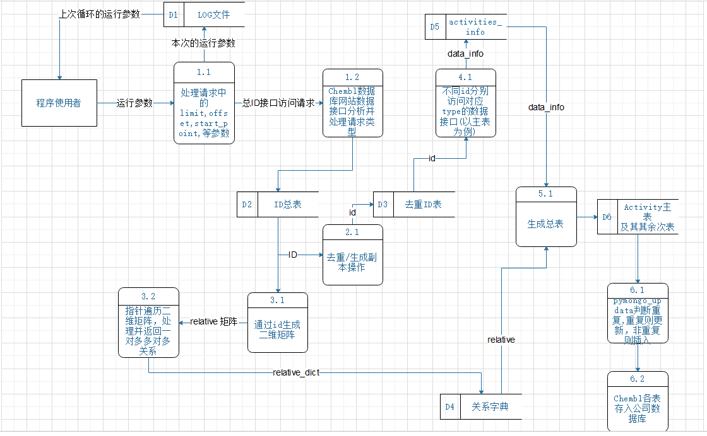

# ProGO, a document-based protein association database

Proteins can adopt multiple conformations depending on their active state, and structural variations can arise from the use of different methods, such as X-ray or NMR. Additionally, the resolution of the measurements can also impact the final spatial conformation.

Traditional protein databases provide extensive data on sequences, structures, and functions but often lack direct integration. For instance, UniProtKB offers sequence and functional annotations, while structural data must be retrieved from sources like PDB or AlphaFold Database, and molecular activity and drug target information from databases like ChEMBL. This fragmentation complicates data access and integration. Most publicly available databases are based on MySQL, and they tend to be less efficient and convenient in terms of access and retrieval compared to document-based NoSQL databases. 

To address this, we developed ProGO, a document-based protein association database that unifies data from multiple authoritative sources (Uniprot, PDB, AlphaFold and ChEMBL), thus enables users efficiently filter and retrieve required data based on specific criteria.

The current version of ProGO database contains 47,789 protein entries with associated information especially for sequence, multiple structure conformations and function details. The overall database structure is illustrated in Figure1, with detailed statistics provided in Table1.

## 1. Dependencies

- python == 3.8
- jsonpath == 0.82
- pymongo == 3.12.1

## 2.Protein Association Database Scrapy

### 2.1 Uniprot Database Scrapy

- **UniProt_Scrapy/DeepFRI_mapping_UPID** and **UNIPROT_id_DeepFRI.txt** contain the mapping of all protein chain PDB IDs in the DeepFRI dataset to their corresponding UniProt database IDs.

- **UniProt_Scrapy/uniprot_id.csv** and **uniprot_id_expanded** contain over 20,000 human proteins additionally filtered from the Swiss-Prot database.

- **UniProt_Scrapy/UniProt_HTML_parser_fromTable_withfiles.py**: This is a UniProt web scraper script that directly parses the HTML code from the UniProt website. It extracts relevant data and converts it into a JSON dictionary, which is then stored in MongoDB.

- **UniProt_Scrapy/UniProt.py**: Unlike the PDB website, the HTML source code of the UniProt webpage sometimes cannot be directly parsed using BeautifulSoup's `html.parser` (which may be due to browser compatibility issues or anti-scraping plugins on the UniProt site). In such cases, the script instead makes requests to UniProt's official data API to retrieve the necessary data.

- **UniProt_Scrapy/uniprot_refineFinal.py**: The final version of the UniProt data API scraper script. It integrates and adds multiple new features, allowing it to scrape and parse complex association data returned from several different interfaces.

- **UniProt_Scrapy/uniprot_structure.py**: This script parses multiple conformations of a protein and associates them with the PDB database. It retrieves the structural data of a protein’s different conformations and links them to the corresponding entries in the PDB.

  

### 2.2 PDB Database Scrapy

- **PDB_Scrapy/PDB_id_DeepFRI.txt**: Contains the PDB IDs corresponding to all 36,641 protein chains in the DeepFRI dataset.

- **PDB_Scrapy/PDB_to_ProteinStructure.py**: This script scrapes and classifies PDB structure files, splitting large file objects into smaller chunks (typically 256k per chunk). Each chunk is then stored as a separate document in the **chunks** collection of MongoDB.

  

### 2.3 AlphaFold Database Scrapy

- **UniProt_Scrapy/uniprot_refineFinal.py**: This script is used to extract associated data from the AlphaFold data interface based on the UniProt ID (UPID).
- **ScrapyForAlphaFold.py**: This script reads and downloads the corresponding PDB structure files from the AlphaFold database.

### 2.4 ChEMBL Database Scrapy

- **Chembl_Scrapy/chembl4.0.py** :
  - Using the **activities** table as the main table, with **active_id** as the primary key, create the main table **activate**, which contains cross-referenced attributes.
  - Segment each ID through code and store them in different lists: **molecule_id_list**, **target_id_list**, **assay_id_list**......
  - Access the corresponding interfaces using different types of IDs and parse the returned XML files using BeautifulSoup.
- **Chembl_Scrapy/relative_found.py**: This script identifies the relationships between different ID tables, including one-to-one and one-to-many associations.
- **Chembl_Scrapy/chembl4.0.py** :Also perform cross-referencing of certain table entries through different interfaces, such as:
  - The **compound_key** attribute cannot be found in either the **compound** or **molecule** interfaces; it must be accessed through the **record ID** via the Compound Record interface to be located.
  - The **record ID** is in the main table **activity**, and it can be used to access the Compound Record interface.:https://www.ebi.ac.uk/chembl/api/data/compound_record/ + str(record id)

- **Chembl_Scrapy/chembl_refine.py**: As a refined version of **chembl4.0.py**, this version removes unnecessary attributes and methods, optimizing code execution efficiency and reducing the time complexity for deduplication, updating, and other operations. However, it also eliminates many table items and features. After running this program, the user will be prompted to enter two parameters:

  - **How many activities IDs do you need per cycle?** (Recommended: 50). If the number exceeds 50, the system may run out of cache and crash. This parameter determines how many activate activity data entries and their corresponding entries in other sub-tables will be scraped per cycle.

  - **Where should the new breakpoint start?** This parameter sets the breakpoint (offset). Based on the offset, the code will send requests to the Chembl data interface and return data starting from the specified point.

  - **Log Document**: The above two parameters can be retrieved from the log table generated by the program. The log is stored in the same collection path as the other tables. Every time a successful run occurs (all cycles completed), a log entry is generated and stored in MongoDB. The parameters for the next run can be chosen based on the most recent log (logs have a timestamp).

The complete program pipeline and data flow are shown in the diagram below:

The detailed project documentation can be found at: https://pixeldrain.com/u/hfW46PMZ

### 2.5 ChEMBL Database Scrapy(support information)

ChEMBL is a large, open-access drug discovery database designed to collect chemical data and knowledge related to drug research and development. It includes information on small molecules and their biological activities derived from full-text articles in several core pharmaceutical chemistry journals, and integrates data on approved drugs and clinical development candidates (such as mechanisms of action and therapeutic indications). The biological activity data is also exchanged with other databases, such as PubChem BioAssay, BindingDB, PubMed, and more.

#### 2.5.1 **ChEMBL Database Official Website Interface Documentation**:

ChEMBL, as an open-source database, provides users with a complete and fully functional set of data interfaces on its official website. Here, I have selected a few representative interfaces for introduction. For detailed information on all available interfaces, please refer to the web service section of the ChEMBL official website:

**For Example:**

- **Interface Name: ChEMBL ID Lookup**: This interface is used to retrieve all the ChEMBL IDs. After validating this interface, it is confirmed that the default returned XML contains the data corresponding to the respective IDs.
- **Interface Name: Binding Site**: This interface is used to retrieve the definitions of all target binding sites.

#### 2.5.2 The **ChEMBL interface's breakpoint request**

When making a POST request to the corresponding interface path, such as: `url:/?limit=1&offset=2`:

- **limit** defines the maximum number of data entries returned in the response.
- **offset** acts as the breakpoint on the ChEMBL webpage, determining where to start retrieving data from.

For example, **limit = 20** and **offset = 10** means that the interface will begin returning data from the 10th entry and will return 20 data entries in total.

## 3. MySQL(ChEMBL 32) -> MongoDB

Due to the large number of interfaces required by the ChEMBL scraper program, it is normal for the speed to be slow. The time consumption is also influenced by factors such as network speed and the stability of the object server (ChEMBL website server). Since this is an overseas website, the data interfaces are not very stable and often result in failed requests.

Although error handling has been added to the code, where it will continue retrying until successful in case of failure, using the scraper above to fully associate the entire ChEMBL database can be time-consuming.

To facilitate the association of various data in the ChEMBL database, especially **ChEMBL_target**, which contains information on target proteins, we directly parse the local MySQL database instead, in order to obtain the complete ChEMBL association information dictionary. (ChEMBL official database documentation: https://ftp.ebi.ac.uk/pub/databases/chembl/ChEMBLdb/latest/schema_documentation.txt).

### 3.1 Basic information

- **MySQL_chembl/MySQL_chembl_activity.py**: Performs regular expression filtering and cleaning on the **activity** table data, converting it into a JSON dictionary and storing it in MongoDB.

  **MySQL_chembl/MySQL_chembl_Doc.py**: Similar to the above, but with the **Document** table data.

  **MySQL_chembl/MySQL_chembl_assay.py**: For the **Assay** table data.

  **MySQL_chembl/MySQL_chembl_cell.py**: For the **Cell** table data.

  **MySQL_chembl/MySQL_chembl_component.py**: For the **Component** table data.

  **MySQL_chembl/MySQL_chembl_compound&molecule.py**: For the **compound** and **molecule** table data.

  **MySQL_chembl/MySQL_chembl_domain.py**: For the **Domain** table data.

  **MySQL_chembl/MySQL_chembl_metabolism.py**: For the **Metabolism** table data.

  **MySQL_chembl/MySQL_chembl_product.py**: For the **Product** table data.

  **MySQL_chembl/MySQL_chembl_record.py**: For the **Record** table data.

  **MySQL_chembl/MySQL_chembl_target.py**: For the **Target** table data.

### 3.2 Drug information

In the ChEMBL database, there is not only the data types mentioned above, but also a special hidden category of data, namely **Drug** data.

- These data types do not have any direct relation to the main **Activity** table, meaning there is no **Drug_id** field linking them.
- Each of these data types has its own unique primary key, such as **drug_indication**, **drug_mechanism**, and **drug_warning**.
- They all share the **record_id** foreign key, which is also a unique key.
- There exists both one-to-one and one-to-many relationships between them, where a single **record_id** can correspond to zero or more entries from the above-mentioned tables.

Therefore, we further refine the **Drug** and **target protein** tables separately as follows:

- **MySQL_chembl/MySQL_chembl_Drug_assembl.py**: Processes the Drug table data and organizes it accordingly.

- **MySQL_chembl/MySQL_chembl_Drug_assembl_2.0.py**: Identifies one-to-one and one-to-many relationships within the Drug table entries.

- **MySQL_chembl/MySQL_chembl_drug_indication.py**: Generates entries for the **drug_indication** related to Drugs.

- **MySQL_chembl/MySQL_chembl_drug_mechanism.py**: Generates entries for the **drug_mechanism** related to Drugs.

- **MySQL_chembl/MySQL_chembl_drug_warning.py**: Generates entries for the **drug_warning** related to Drugs.

The detailed project documentation can be found at:https://pixeldrain.com/u/SMohrnkK

